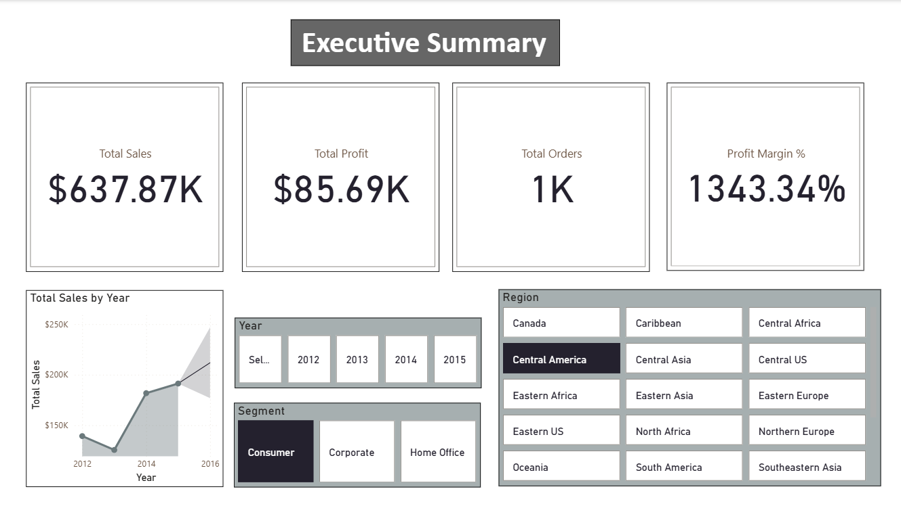
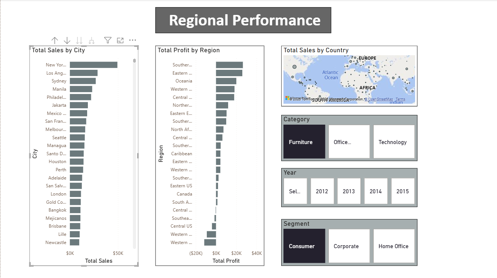
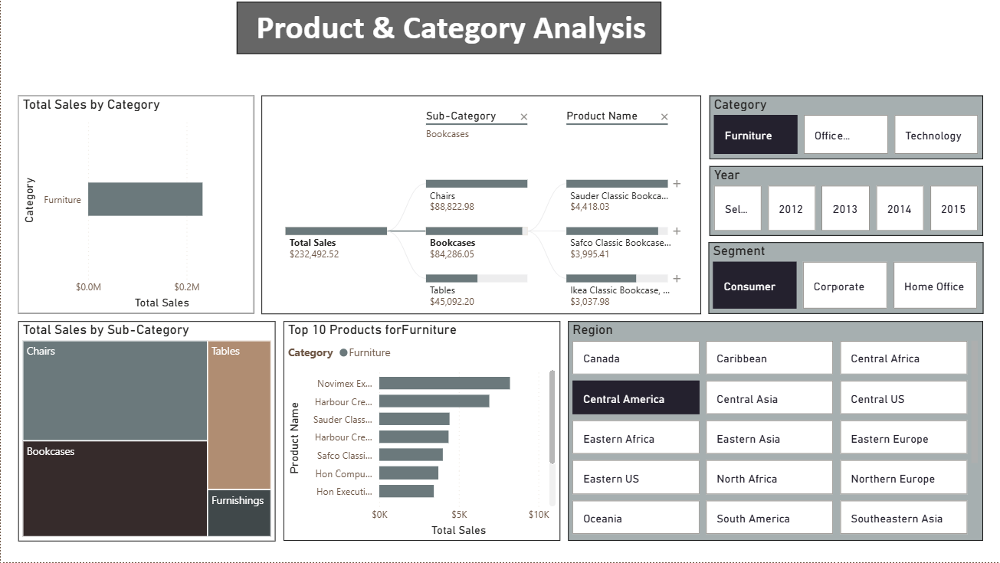

# Global Superstore Sales & Product Analytics Dashboard
- Project Overview

This project presents an interactive business intelligence dashboard built using the Global Superstore dataset in Power BI.

The objective was to design an executive-level reporting solution that enables stakeholders to:

Monitor overall revenue and profitability trends

Identify high- and low-performing regions

Analyze product-level revenue contribution

Drill down into key revenue drivers

The dashboard simulates a real-world BI environment with structured data modeling, DAX calculations, and interactive analytics.

# Business Objectives

Track total Sales, Profit, and Order Volume

Analyze revenue concentration by region

Identify product categories driving profitability

Detect underperforming segments

Enable drill-down analysis for decision-making

# Tools & Technologies

Power BI

DAX (Data Analysis Expressions)

Data Modeling & Relationships

Interactive Visual Analytics

Forecasting & Drill-through Analysis

# Dashboard Pages & Analytical Focus
1. Executive Summary

KPI cards: Total Sales, Total Profit, Order Count

Time-series revenue trend analysis

Forecasting for sales projection

Interactive slicers for dynamic filtering

Purpose: Provide leadership with a quick snapshot of business health.

2. Regional Performance Analysis

Sales comparison across global regions

Profitability breakdown by geography

Drill-through capability for region deep dive

Purpose: Identify revenue concentration and geographic risk.

3. Product & Category Analysis

Category and Subcategory performance breakdown

Treemap for revenue concentration

Decomposition Tree (Category → Subcategory → Product)

Top 10 Products by Sales

Dynamic DAX-based titles

Purpose: Detect product segments driving growth and profitability.

# Dataset

Global Superstore Dataset (Public Sample Dataset)

Includes:

Multi-year transactional sales data

Customer segments

Regional distribution

Product categories and subcategories

Profit and shipping details

# Key Business Insights

A small number of regions contribute a large share of total revenue.

Some subcategories generate high sales but low profit margins.

Revenue concentration patterns highlight dependency risk.

Drill-down analysis reveals specific products driving performance.

# Business Impact

This dashboard provides a structured decision-support system for:

Executive-level revenue monitoring

Profitability optimization

Regional strategy planning

Product portfolio evaluation

# Visualizations

Add screenshots inside an images folder and reference like this:

Recommended screenshots:

Full Executive page

Regional analysis page

Product analysis page

# Skills Demonstrated

Business Intelligence Reporting

Data Modeling & Relationship Management

Advanced DAX Calculations

Executive Dashboard Design

Translating Business Questions into Visual Analytics

# Author

Neha Raut
